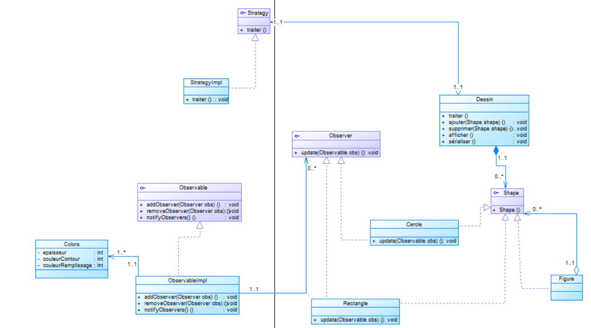
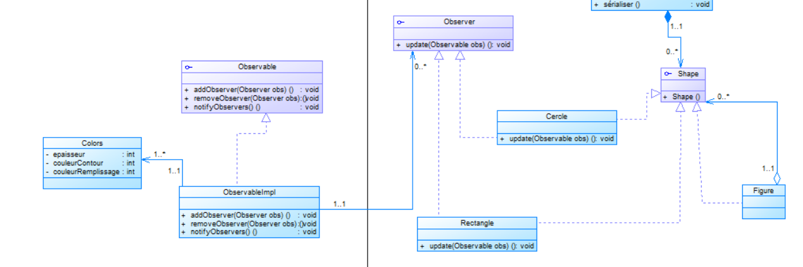
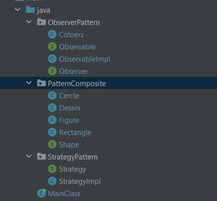

# Examen Blanc Design Pattern et Programmation Orientée Aspect
 ## 1. Etablir un Diagramme de classe du modèle en appliquant les design patterns appropriés en justifiant les designs patterns appliqués. 

### explication 
Pour donner la possibilité de Créer un groupe de figures. Chaque groupe peut contenir d’autres
groupes. on utilise Pattern Composite

Pour assure qui nous introduisons un Objet Paramétrage dont l’état est défini par attributs par défaut comme
l’épaisseur du contour, la couleur du contour et la couleur de remplissage. On voudrait qu’à
chaque fois que l’état de cet objet change, toutes les figures doivent être notifiées pour se
mettre à jour. on utilise Pattern Observer

Pousr assure Une méthode « traiter » qui permet de traiter le contenu du dessin en utilisant une
famille d’algorithmes qui sont interchangeables dynamiquement. Ce signifie qu’au
moment de l’exécution, l’objet dessin pour changer d’algorithme avec un autre de la
même famille. Chaque algorithme peut évoluer indépendamment de la classe dessin
qui les utilise. on utilise Pattern Strategy

 ## 2. Faire une implémentation du modèle en utilisant un projet Maven sans prendre enconsidération des aspects techniques.
La structure de notre application

## 3. Effectuer des Tests du modèle
==> Test

==> Resultat

 ==> Serialized file

